# Implementation Plan: Extended Service Catalog with Taxonomy Filtering

## Overview

Extend the Chappy Configure tab to include additional services beyond chat apps, organized by taxonomy categories with a custom filter UI.

---

## Taxonomy Categories

Define the following taxonomy categories that can be assigned to services:

| Category | Description | Color (suggested) |
|----------|-------------|-------------------|
| `chat` | Messaging and chat services | `#38bdf8` (sky) |
| `social` | Social media platforms | `#a855f7` (violet) |
| `productivity` | Work and productivity tools | `#10b981` (emerald) |
| `ai` | AI assistants and tools | `#f97316` (orange) |
| `streaming` | Video/audio streaming platforms | `#f43f5e` (rose) |
| `news` | News and media platforms | `#eab308` (yellow) |

---

## New Services to Add

### Social Category
| Service | URL | Description |
|---------|-----|-------------|
| Facebook | https://facebook.com | Meta's main social platform |
| BlueSky | https://bsky.app | Decentralized social microblogging |
| Mastodon | https://mastodon.social | Open-source federated social network |
| X (Twitter) | https://x.com | Social microblogging platform |
| TikTok | https://www.tiktok.com | Short-form video platform |
| LinkedIn | https://www.linkedin.com | Professional network (full site) |

### Streaming Category
| Service | URL | Description |
|---------|-----|-------------|
| YouTube | https://www.youtube.com | Video sharing and streaming |
| Spotify | https://open.spotify.com | Music streaming |

### AI Category
| Service | URL | Description |
|---------|-----|-------------|
| ChatGPT | https://chat.openai.com | OpenAI's AI chatbot |
| Claude | https://claude.ai | Anthropic's AI assistant |
| xAI / Grok | https://x.ai | xAI's Grok chatbot |
| Z.ai | https://z.ai | AI assistant (Chinese) |
| DeepSeek | https://chat.deepseek.com | DeepSeek AI assistant |
| Perplexity | https://www.perplexity.ai | AI-powered search engine |

### Productivity Category (add to existing)
| Service | URL | Description |
|---------|-----|-------------|
| Notion | https://www.notion.so | All-in-one workspace |
| Linear | https://linear.app | Issue tracking for teams |
| Asana | https://app.asana.com | Work management platform |

### Existing Services - Add Taxonomy
Update existing services with taxonomy tags:

| Service | Taxonomy |
|---------|----------|
| WhatsApp | chat |
| Messenger | chat, social |
| Instagram DMs | chat, social |
| Discord | chat, social |
| Telegram | chat |
| Slack | productivity, chat |
| Microsoft Teams | productivity, chat |
| LinkedIn Messages | chat, productivity |
| Google Chat | chat, productivity |
| Gmail | productivity |
| Trello | productivity |
| Google Calendar | productivity |
| Signal | chat |

---

## Implementation Tasks

### Phase 1: Data Layer

#### 1.1 Update `serviceCatalog.core.mjs`
- Add `taxonomies` array field to each service (supports multiple categories)
- Add all new services with appropriate taxonomies
- Keep existing services but add taxonomy field

```javascript
// Example structure:
{
  id: 'facebook',
  title: 'Facebook',
  url: 'https://facebook.com',
  color: '#1877f2',
  description: "Meta's main social platform",
  taxonomies: ['social']
}
```

### Phase 2: Icon Assets

#### 2.1 Create SVG icons for new services
Create icons in `src/renderer/assets/icons/`:
- `facebook.svg`
- `bluesky.svg`
- `mastodon.svg`
- `youtube.svg`
- `x.svg` (X/Twitter logo)
- `spotify.svg`
- `tiktok.svg`
- `chatgpt.svg`
- `claude.svg`
- `xai.svg`
- `zai.svg`
- `deepseek.svg`
- `perplexity.svg`
- `notion.svg`
- `linear.svg`
- `asana.svg`

#### 2.2 Update existing icons
- Update `linkedin.svg` to be the full LinkedIn logo (currently shows messaging icon)

### Phase 3: UI Components

#### 3.1 Add filter state in App.vue
Add reactive state for selected taxonomy filters:
```javascript
const selectedTaxonomies = ref(new Set());
const allTaxonomies = ['chat', 'social', 'productivity', 'ai', 'streaming', 'news'];
const taxonomyLabels = {
  chat: 'Chat',
  social: 'Social',
  productivity: 'Productivity',
  ai: 'AI',
  streaming: 'Streaming',
  news: 'News'
};
```

#### 3.2 Create filtered computed property
```javascript
const filteredServices = computed(() => {
  if (selectedTaxonomies.value.size === 0) {
    return availableServices;
  }
  return availableServices.filter(service => 
    service.taxonomies?.some(t => selectedTaxonomies.value.has(t))
  );
});
```

#### 3.3 Add taxonomy filter UI in Configure tab
Add horizontal filter bar above the services grid:
- "Show All" toggle (when no filters selected)
- Horizontal custom-styled checkboxes for each taxonomy
- Checkboxes should be toggle-able (check/uncheck)
- Visual indication of active filters

#### 3.4 Custom CSS checkboxes
Add styles in `tailwind.css`:
- Custom checkbox appearance (hide native checkbox)
- Styled :checked state with gradient background
- Support both light and dark mode
- Smooth transitions

### Phase 4: Styling

#### 4.1 Add custom checkbox styles in `tailwind.css`
```css
/* Custom checkbox styles */
.custom-checkbox {
  appearance: none;
  -webkit-appearance: none;
  width: 1.25rem;
  height: 1.25rem;
  border: 2px solid var(--ch-border-soft);
  border-radius: 0.375rem;
  cursor: pointer;
  transition: all 0.2s ease;
}

.custom-checkbox:checked {
  background: linear-gradient(135deg, #38bdf8, #a855f7);
  border-color: transparent;
}

/* Light mode adjustments */
[data-theme='light'] .custom-checkbox {
  border-color: #94a3b8;
}
```

#### 4.2 Taxonomy badge colors
Add color-coded badges for each taxonomy category in the service cards.

---

## File Changes Summary

| File | Changes |
|------|---------|
| `src/renderer/data/serviceCatalog.core.mjs` | Add taxonomies array to all services, add new services |
| `src/renderer/assets/icons/*.svg` | Create 16+ new SVG icon files |
| `src/renderer/App.vue` | Add filter state, computed property, filter UI markup |
| `src/renderer/styles/tailwind.css` | Add custom checkbox styles, light/dark mode support |

---

## Mermaid Diagram: Filter Flow

```mermaid
flowchart TD
    A[User clicks Configure tab] --> B[Render Available Services Grid]
    B --> C[Check if any taxonomies selected]
    C -->|No| D[Show All Services]
    C -->|Yes| E[Filter services by selected taxonomies]
    E --> F[Display filtered services]
    D --> F
    
    G[User clicks taxonomy checkbox] --> H[Update selectedTaxonomies Set]
    H --> B
    
    style A fill:#1e293b,stroke:#38bdf8
    style F fill:#0f172a,stroke:#10b981
    style H fill:#a855f7,stroke:#f8fafc
```



---

## Acceptance Criteria

1. ✅ All new services appear in the Configure tab with icons
2. ✅ Each service displays its taxonomy badges
3. ✅ "Show All" option displays all services
4. ✅ Clicking a taxonomy checkbox filters services to show only that category
5. ✅ Multiple taxonomies can be selected (OR logic)
6. ✅ Custom checkboxes styled with CSS (not native HTML)
7. ✅ Both light and dark mode fully supported
8. ✅ Filter UI fits horizontally in existing layout
9. ✅ Smooth transitions when filtering
10. ✅ Existing functionality (add service, quick add) remains intact
